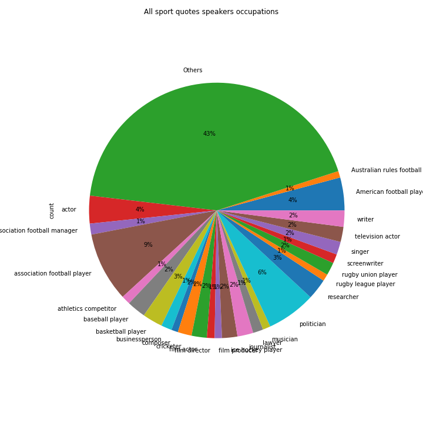
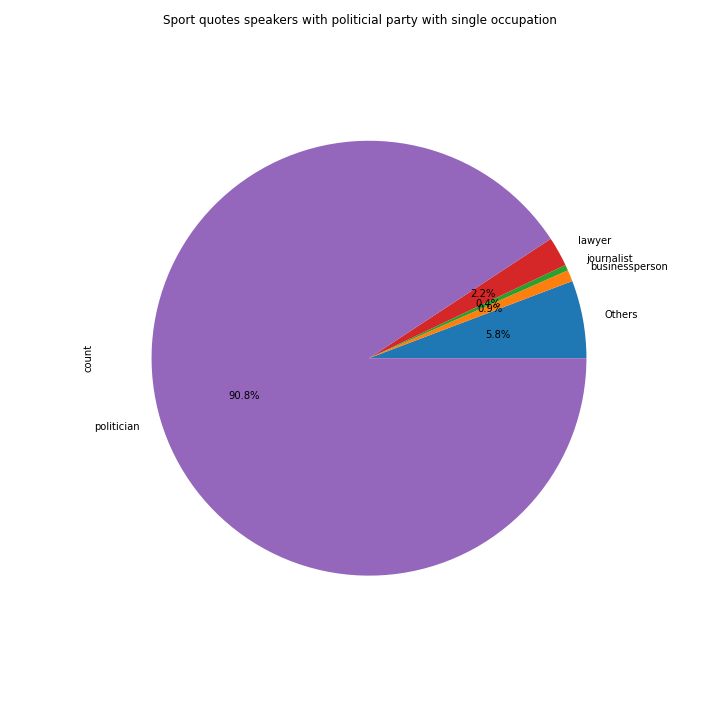
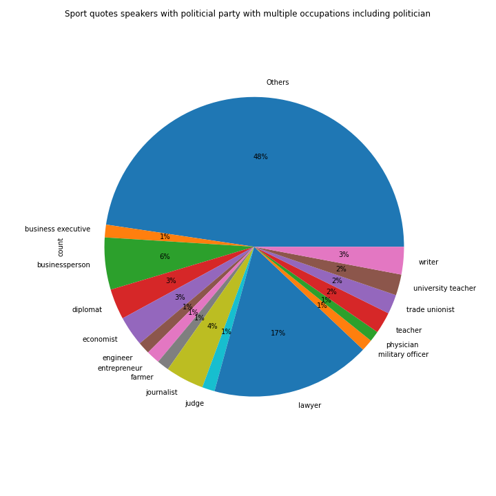
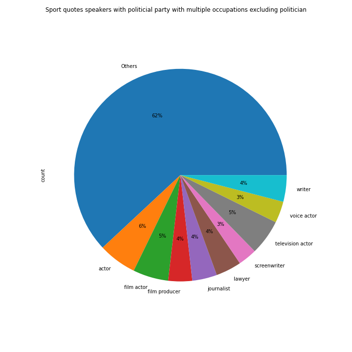
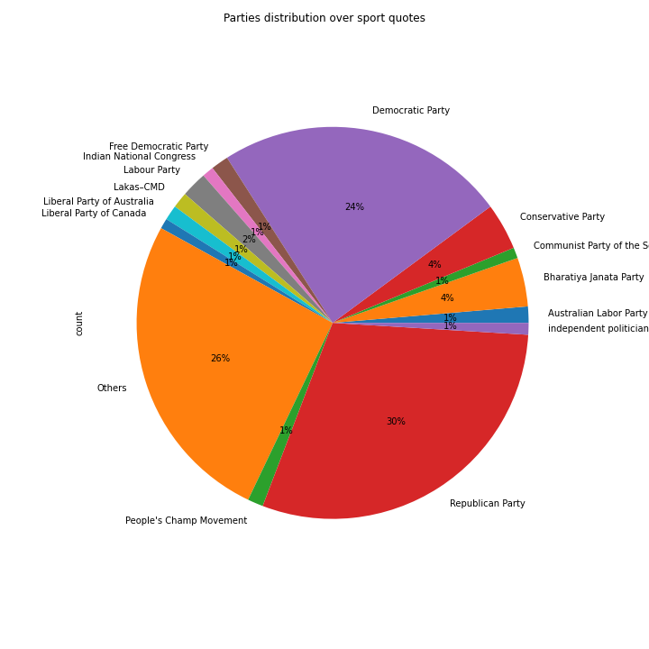
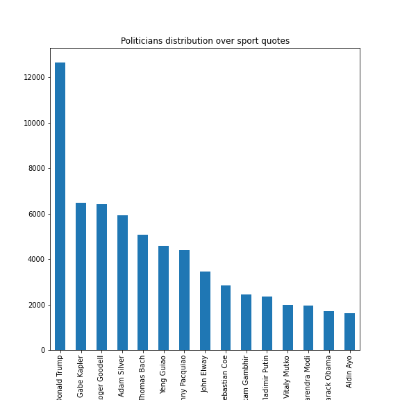
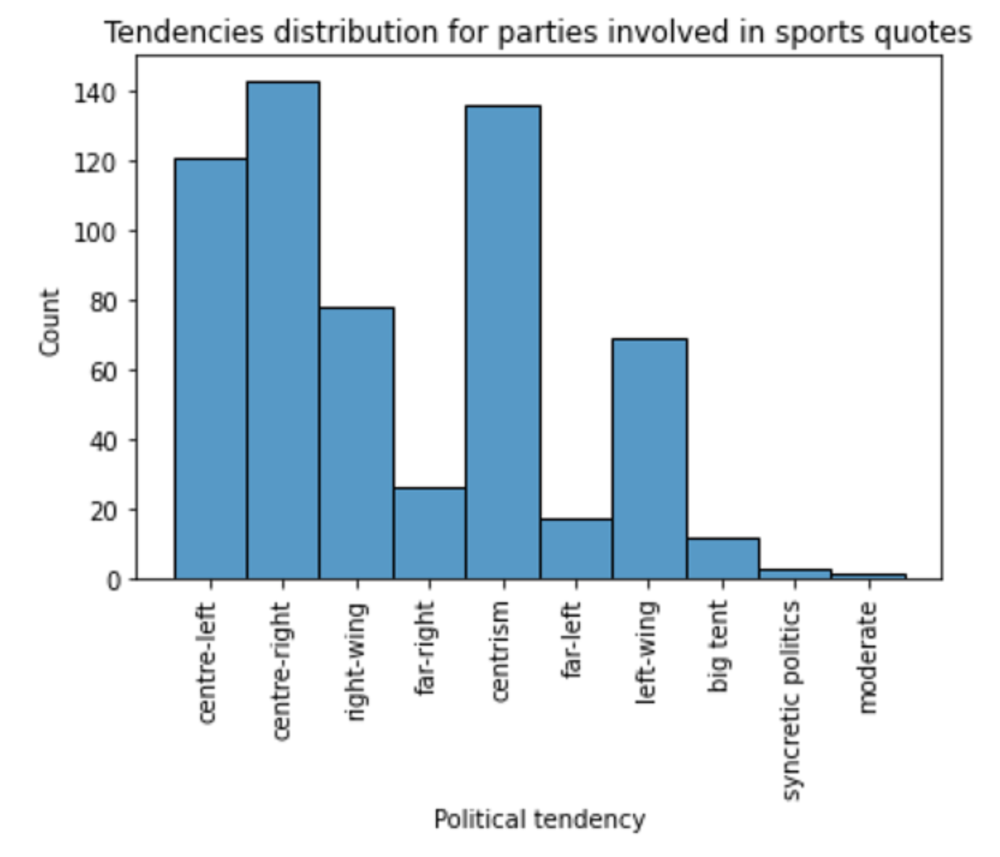
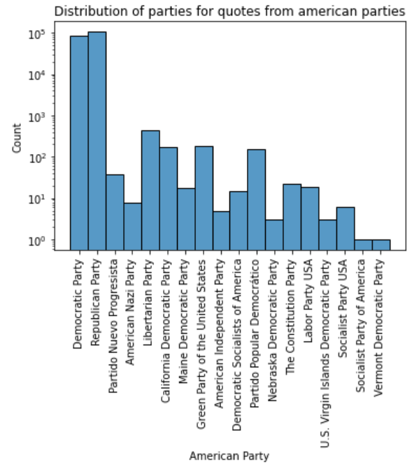

# Politics in sport

## Introduction

Sport and politics have always been and will always be very closely related due to the high media coverage and the emotions involved. From the power demonstrations of nations such as the Olympic games of Berlin 1936, going through movements such as the "black power" salute on the podium of 1968 Olympics games, to unification symbols such as the 1995 rugby world cup organized and won by South Africa just after the end of apartheid. More recently, movements such as Black Lives Matters have been strongly supported by athletes while the US, Australia, UK and Canada announced a diplomatic boycott of Beijing 2022 Olympic games. 

All of these movements are well known political actions and show how strong the bond between sport and politic is. But what if they were just the tip of the iceberg ? Having a big dataset of quotes, the idea of this data story is to investigate the link between sports media and politics. How much the quotes in sport articles are related to politicians ? Are politicans trying to use sport and the related media coverage to influence the votes ? Are all the medias the same or certain are more politicized ? 

A lot of questions can be raised and the analysis can quickly become complex. This datastory aims to bring an answer supported by data to certain of these questions.

The data used for the entire analysis are Quotebank data for the years 2015 to 2020, where only quotes from sports media are selected.

## Exploring data
### All sport quotes speakers : occupation distribution

In order to quantify the scale of the phenomenon that we propose to study, we start by looking at the distribution of all speakers' occupations among all sport quotes.

Results show that the main occupations of sport quotes speakers are first association football player (up to 9%) and second politician (up to 6%). It is quite surprising at first sight to observe such a presence of politicians in sports quotes. That’s why it may be interesting to further analyze this phenomenon. It should also be noted that the other professions that stand out are either professions directly linked to sport, or professions generating a certain notoriety (actor, business person, journalist, writer, lawyer, etc.).

### Speakers with political party : subset definition

It is interesting to note that not only politicians are assigned to a political party on wikidata. In fact, people with other professions but who are involved in campaigns are also attributed to a political party. These people might also want to influence the sports media audience in the direction of their political activism. So, for the purpose of conducting a comprehensive analysis on politics in sports media, it is actually interesting to consider the quotes of all people linked to a political party potentially political.

The subset of speakers with a political party represents 8.78% of speakers in sports quotes. As this percentage is significant, we consider analysing politics in sport is once again worth it.

### Speakers with political party : occupation distribution

In order to draw correct conclusions from our study, it is however important to identify and quantify more exactly what are the occupations of people who have a political party among the speakers of sports quotes.

Since these people sometimes have several jobs, our analysis of speaker occupancy has been broken down into 3 parts according to the number of different occupations for each speaker.

More exactly, we consider the following three different scenarios to better visualize the results:
- speakers with a political party and a single occupation
- speakers with a political party and several occupations including politician
- speakers with a political party and several occupations excluding politician

#### Speakers with a single occupation

The distribution of occupancies for speakers with a single occupation is shown below. This category represents 59% of sport quotes speakers with a party.

In the case of a single occupation, it remains mainly politicians.  This was expected as the study is carried on people being attributed to political parties. This is also reassuring because it shows that our study will be able to take into consideration the interesting phenomenon of the few non-politicians being attributed to a political party while being mainly centered on politicians.

#### Speakers with multiple occupations including politics

The distribution of occupancies for speakers with multiple occupations including politics is shown below. This category represents 33% of sport quotes speakers with a party.

In this case, we can observe that politicians often have other professions which seem all linked to the human sciences and the media (lawyer, business person, journalist, etc.). This is a fairly consistent result of the image one can have of a politician.

#### Speakers with multiple occupations excluding politics

The distribution of occupancies for speakers with multiple occupations excluding politics is shown below. This category represents 6% of sport quotes speakers with a party.

Thanks to this pie chart, we see that the most represented occupation is actor. The other professions present are also professions with significant media coverage. This can be interpreted as following, famous people often having a political party take advantage of their popularity to convey political opinions.

Again, this is interesting to consider these people as “politicians” for us because we are interested in the political messages conveyed, not only by politicians but more broadly by individuals involved in politics.

However, remember that the majority of speakers attributed to a party are politicians.

### Which political parties & politicians are most present in the sports quotes ?

For the rest of the analysis, we consider as “politician” a person with a political party given that, as justified above, we realize that for our analysis this would make a lot more sense.

#### Parties

We can observe that Democrats and Republicans are mostly represented but we can also notice the presence of many smaller parties.

These two parties stand out the most because the quotes are English speaking, so it seems quite logical that the main parties of the biggest English speaking countries are most represented. Note that this can be considered as a limitation of our analysis since our objective would ideally be to study politics in sport without geographic bias.

#### Politicians : 

The graph below shows the number of quotes from the 15 politicians most present as speakers in sport quotes.

The first politician most prominent in sports quotes is President Donald Trump. We can note that this one is much more quoted than the other politicians, whose distribution is homogenized rather quickly. More exactly, President Donald Trump is cited two times more than the second cited politician over sport quotes. However, President Donald Trump only represents 3.45% of speakers in sports quotes.

## What is the distribution of the political tendency of the political parties present in the sports quotes (going from far right to far left)?

Apart from the Republican and Democratic political parties of the United States, which together represent more than half of the political parties, the distribution of political parties displayed above presents fairly splitted data due to the presence of a multitude of minor political parties.
In order to make these data more usable, it is here proposed to analyze the distribution of political tendencies of these parties.

The results show that the major tendency is center, with centrism, center right and center left equally distributed. The right and left wings are about half the size of the center, and are also evenly distributed. There are very few extremes.

## What is the distribution of the political parties present for a specific country?

It is important to note that sometimes parties have the same name but come from two different countries. This can bias the results.
In the context of a precise study of the distribution of political parties, this problem can be addressed by explicitly controlling the country of origin of political parties.
Here we did this for the parties of the United States. The new distribution is displayed below on a logarithmic scale to improve the visibility of minor parties.

In the case of the United States, the Republican and Democratic parties stand out considerably from other parties. What had already been underlined in the overall distribution of political parties made above, this is normal given the very large difference in the presence of these two parties compared to the others. The differences in the data caused by selecting only American parties are not felt on such high values. Moreover, minor parties often seem to be variations of the two major parties as well.

## How much of the sport quotes among each media is politics related?

So far it appears that quotes among sports media are actually linked to politics. However, we still wonder if all medias are the same regarding this bias. To do so, we can have a look to the proportion of political speakers among the different sports media. However, we have more than 2 000 different media sources, so we first need to pick a selection of them. Let's have look to the 30 biggest sports media in terms of number of sport quotes between 2015 and 2020 :

We can see that the 30 biggest medias have at least 300 000 quotes whereas only two medias really stand out : Yahoo and MSN with more than 2 million sport quotes.
Now, that we have this selection of sports media, let's see what the proportion of political speakers in sport quotes there is for each media : 

As one can observe on this image, the proportion of political speakers among the different media ranges from 1.5% for FOXsports to 71% for KRMG. This seems to indicate that certain media are definitely more politicized than others and uses their sports section also for political reasons.

## How does this phenomenon evolve over time? For instance, does it increase before elections?

Another interesting question to ask is : how does the phenonenon of having politicized quotes in sports article evolves through time. For instance, does it increases during the during the campaigns of the US presedential elections ? 

To try to bring an answer, we wanted to have a look at the policized sports quotes each month over the years and here is what we obtained : 

Unfortunately, as one can observe, it is not possible to identify any trends due to the huge variations of sports quotes through the years, itself related to the variation of all the quotes availble in the database at first. Indeed, we relate the drops in 2016 to the one mentionned in the [article about quotebank](https://dlab.epfl.ch/people/west/pub/Vaucher-Spitz-Catasta-West_WSDM-21.pdf).

However, another approach is to have a look at the media themselves and how their tendancies have evolved through time : 

This first graph shows the standard deviation of the percentage of politicised sports quotes over the 6 years of data. We can observe that certain media are very stable with a standard deviation inferior to 1% over 6 years, whereas other are highly unstable, reaching more than 26% for KRMG. This could be related to a change of internal policy or direction. 

To visualize better what is going on through the years for the most unstable medias, i.e. with a standard deviation superior to 10 :

We can observe that for instance that for MSN there is a downward trend with a sharp drop after 2015, but it stayed relatively stable afterwards. JDSupra shows no clear trends whereas the rest of the medias show relatively upward trends.

## What are the more represented topics in sport quotes?

We are now interested in figuring out if the sport quotes said by politicians are actually related to politics. 

In order to answer this question, we perform a topic analysis on all theses sport quotes said by politicians. 

Using LDA, we find the more likely topic for each quote, the graph below shows the evolution of the proportion of theses 4 topics over years.  

This graph shows that the politics-oriented sport quotes said by politician represents between 25% and 30%. Another topic very present topic encompasses daily life themes (30%-38%). Finally, the two last topics are obviously sport-related (30%-35%). 

We can also add that the percentage of politics-related sport quotes seems stable over years.

However, the conclusions of this topic analysis must be nuanced by the fact that it is sometimes even difficult for a human to correctly identify the topic of a quotation. This is due to the sometimes very short length of the content of the quote. It seems that the task is even more difficult for a machine. So it seems prudent not to get too attached to very precise results from this study.

# Conclusion

To conclude, this study has shown that the quotes of sports medias are indeed politicized. Surprisingly, we have actually shown that politicians are among the most frequent speakers (6% of the quotes). In addition, we have shown that the different medias are definitely not equal in term of bias as certain have much more politicized quotes. Finally, we have also seen that the most represented speakers or parties seem to align with the popular parties or speakers at that time in the english speaking world. 

However, we have only scratched the tip of the iceberg due to time contraint. For instance, a deeper study could investigate the type of quotes said by politicians and try to figure out if they are deliberately trying to use it as a tool to influence public opinion. The goal of this study was only to look at the facts and give quantities about the connexion of politics with sport medias. The only conclusion we can draw is that there is definitely a link and that certain medias are much more biased. Therefore the reader and sports enthusiasts should be aware of this phenomenon to keep a critical mind while reading sport articles, despite that this isn't the place where one would expect politics to be influent.

## Code

[Here](https://github.com/epfl-ada/ada-2021-project-gag/tree/master) you can find the notebook processing all the data and generating the figures displayed.

# The GaG team

Maxime Dulon, Etienne Mordret, Francesca Paola Nicoletti, Nicolas Raulin

